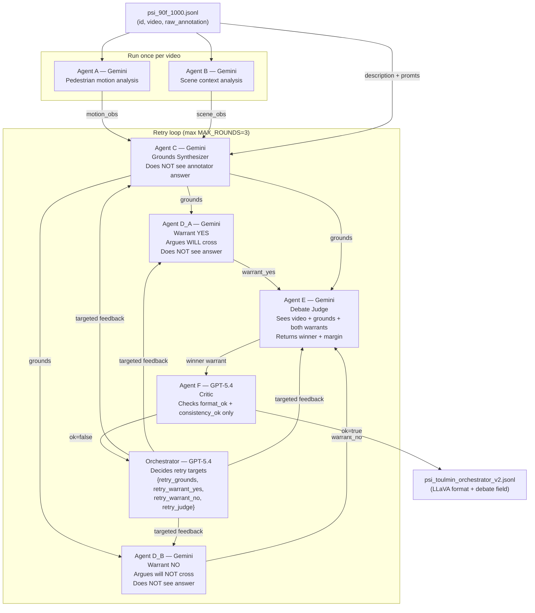
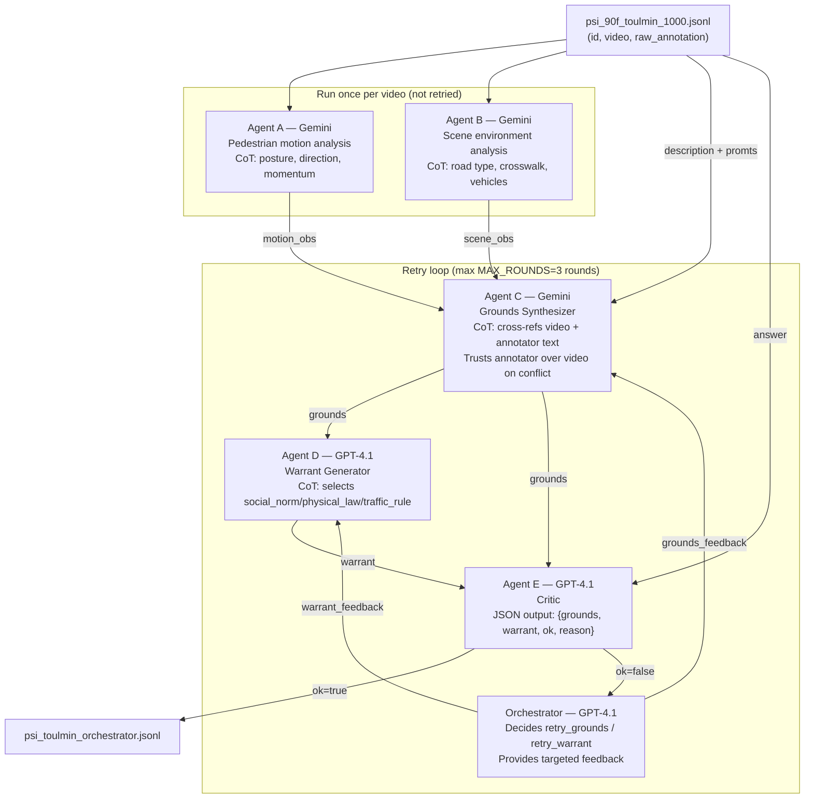
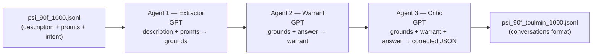

# cosmos2_sft

Fine-tunes `nvidia/Cosmos-Reason2-8B` (Qwen3-VL, 8B) via SFT then GRPO to predict pedestrian crossing intention from driving videos. Every prediction is structured as a **Toulmin argument**: `grounds → warrant → answer`. Training data is generated by a multi-agent LLM pipeline that lives in `PSI_change/json_mode_90/`.

---

## Directory Structure

```
cosmos2_sft/
│
├── # ══════════════════════════════════════════════════════
├── # CORE: agentic data pipeline + data artifacts
├── # (read this region first — it drives everything else)
├── # ══════════════════════════════════════════════════════
├── PSI_change/json_mode_90/
│   │
│   ├── # ── Step-by-step pipeline scripts ──────────────────
│   ├── step_1_make_dataset.py       # RAW → psi_90f_raw.jsonl + mp4 videos
│   ├── select_1000.py               # balanced sampling + intent filter → psi_90f_1000.jsonl
│   ├── toulmin_agent.py             # 3-agent GPT-only pipeline → psi_90f_toulmin_1000.jsonl
│   ├── check_quality.py             # GPT quality checker → quality_report.csv
│   ├── filter_and_stats.py          # OK filter → psi_sft_final.jsonl
│   ├── to_llava_format.py           # format conversion → psi_sft_llava.jsonl
│   ├── make_grpo_dataset.py         # GRPO set from quality failures → psi_grpo_balanced.jsonl
│   │
│   ├── # ── Alternative/advanced pipelines ─────────────────
│   ├── gemini_toulmin_pipeline.py   # 3-agent multimodal (Gemini grounder + GPT)
│   ├── orchestrator_toulmin.py      # ★ 5-agent multimodal orchestrator (THE MAIN ONE)
│   ├── toulmin_agent_test20.py      # 3-agent evaluation on test set (first 20)
│   │
│   ├── # ── Data files ──────────────────────────────────────
│   ├── psi_90f_raw.jsonl            # all annotator-window records (unfiltered)
│   ├── psi_90f_1000.jsonl           # 1000 balanced, difficulty-filtered records
│   ├── psi_90f_test_eval.jsonl      # evaluation set (held-out)
│   ├── psi_90f_test_toulmin_20.jsonl # agent-generated toulmin for first 20 test records
│   ├── quality_report.csv           # per-record quality check results
│   ├── quality_problems.jsonl       # records that failed quality check
│   │
│   ├── trf_train/                   # ← final training artifacts
│   │   ├── psi_90f_toulmin_1000.jsonl  # toulmin-annotated records (conversations format)
│   │   ├── psi_sft_final.jsonl         # quality-filtered SFT set
│   │   ├── psi_sft_llava.jsonl         # SFT set in video/system/prompt/completion format
│   │   ├── psi_grpo_510.jsonl          # quality-failed records → GRPO candidates
│   │   ├── psi_grpo_balanced.jsonl     # 294-record GRPO training set (70/30 yes/no)
│   │   ├── psi_toulmin_gemini.jsonl    # output of gemini_toulmin_pipeline.py
│   │   └── psi_toulmin_orchestrator.jsonl  # output of orchestrator_toulmin.py
│   │
│   ├── videos/                      # 1,689 mp4 clips (90-frame, green bbox overlay)
│   │   └── video_XXXX_track_YY_SSSSS-EEEEE.mp4
│   │
│   ├── agent_cache/                 # 2,412 SHA256-keyed JSON files (GPT-only pipeline)
│   ├── agent_cache_gemini/          # 15 MD5-keyed .txt files (gemini pipeline, test run)
│   ├── agent_cache_orch/            # 58 MD5-keyed .txt files (orchestrator, test run)
│   └── quality_cache/               # quality checker LLM call cache
│
├── # ══════════════════════════════════════════════════════
├── # Model training
├── # ══════════════════════════════════════════════════════
├── train_psi_video_sft.py           # primary SFT (video input, LoRA r=64)
├── train_psi_multimage_sft.py       # alternative SFT (16 pre-extracted frames, LoRA r=16)
├── train_psi_multimage_sft_old.py   # legacy
├── train_psi_grpo.py                # GRPO, 7 rewards, 8 cached frames
├── train_psi_grpo_claude_new.py     # GRPO, cleaner, 4 frames
├── train_psi_grpo_judge_claude.py   # GRPO with full LLM judge (grounding/bridge/consistency)
├── train_psi_grpo_judge_gpt.py      # GRPO early version (format + correctness only)
│
├── # ══════════════════════════════════════════════════════
├── # Data prep (repo-root level)
├── # ══════════════════════════════════════════════════════
├── transfer_psi_llava.py            # PSI raw → LLaVA-style JSONL (frame extraction, filters)
├── transfer_psi_original_to_video_eval.py  # PSI raw → video eval JSONL
│
├── # ══════════════════════════════════════════════════════
├── # Evaluation
├── # ══════════════════════════════════════════════════════
├── cosmos_video_compare_3models_binary.py  # compare base/SFT/GRPO (binary metrics)
├── cosmos_video_compare_3models.py  # compare base/SFT/GRPO + SBERT cosine
├── eval_reason_compare.py           # base vs SFT (earlier 2-model script)
├── gemini_batch_video.py            # Gemini baseline inference
│
├── # ══════════════════════════════════════════════════════
├── # Utilities
├── # ══════════════════════════════════════════════════════
├── debug_grpo_generate.py           # single-sample inference sanity check
├── test_cosmos_video_block.py       # test video block processing
├── plot_training_logs.py            # plot loss CSV → PNG
├── load_psi_llava.py                # early data-loading prototype
│
├── outputs/                         # LoRA adapter checkpoints (gitignored)
├── eval_outputs/                    # evaluation results: JSONL, CSV, metrics JSON
├── setup_conda_env.sh               # environment setup (single dependency reference)
└── psi_llava_easy200.jsonl          # earlier small image-sequence dataset
```

---

## Tech Stack

| Library | Role |
|---|---|
| `transformers` ≥ 4.45 | `Qwen3VLForConditionalGeneration`, `AutoProcessor` |
| `trl` ≥ 0.11 | `SFTTrainer`, `GRPOTrainer`, `SFTConfig`, `GRPOConfig` |
| `peft` ≥ 0.13 | `LoraConfig`, `PeftModel`, `get_peft_model` |
| `bitsandbytes` | 4-bit NF4 quantization |
| `qwen_vl_utils` | `process_vision_info` — image/video tensor preparation |
| `datasets` | `Dataset.from_list` for in-memory HF datasets |
| `cv2` + `ffmpeg` | Frame extraction and video synthesis |
| `google-generativeai` | Gemini API (visual grounding agents) |
| `openai` | GPT API (warrant/critic/orchestrator agents) |
| `sentence-transformers` | SBERT cosine for reasoning quality eval |
| `sklearn` | `balanced_accuracy_score`, `precision_recall_fscore_support` |

**Base model**: `nvidia/Cosmos-Reason2-8B` (Qwen3-VL architecture)
**GPU target**: Single RTX 6000 Ada (48 GB VRAM)

---

## The Agentic Orchestrator — `PSI_change/json_mode_90`

This is the heart of the project. It is a **multi-agent LLM pipeline** that generates high-quality Toulmin-structured training labels from raw PSI pedestrian intention videos.

### `orchestrator_toulmin_v2.py` — 8-Agent Dual-Warrant Debate (Current Design)

The v2 architecture eliminates answer leakage by generating two **independent competing warrants** — one arguing YES, one arguing NO — before a video-aware judge picks the winner.



**Key architectural properties vs v1:**
- **No answer leakage**: Agents C, D_A, D_B, E never see the annotator's answer.
- **Independent warrants**: D_A and D_B are separate API calls with distinct cache keys (`D_yes` / `D_no` suffix). They cannot influence each other.
- **Video-aware judge**: Agent E is Gemini (not GPT); it sees the file_handle and picks the winner based on video evidence.
- **Both warrants preserved**: The output `debate` field stores `warrant_yes`, `warrant_no`, `winner`, and `margin` regardless of which side wins.
- **`matches_annotator` signal**: `winner == annotator_answer`; records where this is False should be filtered before SFT training.
- **Critic is narrow**: Agent F only checks format and consistency — it does not re-judge the debate.
- **Orchestrator granularity**: Can retry any subset of {C, D_A, D_B, E} independently.
- **Upload retry**: 3 attempts with exponential backoff (fixes v1 single-attempt failure).
- **`orch_decision` pre-initialized**: Before the retry loop (fixes v1 `UnboundLocalError`).
- **Cache directory**: `agent_cache_orch_v2/` — separate from v1's `agent_cache_orch/`.
- **Input**: `psi_90f_1000.jsonl` (v1 used `psi_90f_toulmin_1000.jsonl`).

### `orchestrator_toulmin.py` — 5-Agent System (Reference / v1)



**Key architectural properties:**
- Video is **uploaded once** to Gemini File API; all 3 Gemini agents reuse the same `file_handle`. Deleted in a `finally` block.
- CoT `<thinking>` output is **saved to the JSONL** but **not passed downstream** — it stays local to each agent.
- Critic can **inline-fix** the grounds/warrant before returning the JSON result.
- Orchestrator emits structured JSON: `{retry_grounds, retry_warrant, grounds_feedback, warrant_feedback}`.
- Both pipelines support **resume** (done_ids set loaded from existing output JSONL at startup).
- **Caching**: all LLM calls are keyed by MD5(`file_handle.name + prompt + suffix`) for Gemini, MD5(`json(messages) + temperature`) for GPT. Cached to disk as `.txt` files.

### `toulmin_agent.py` — 3-Agent GPT-Only Pipeline (Earlier)



This is the **production pipeline** that generated the 2,412 cached calls and the 1,000-record training set. The orchestrator version is a newer, richer system under active development.

### `gemini_toulmin_pipeline.py` — 3-Agent Multimodal (Intermediate)

An intermediate design: Gemini watches the video for grounding, then GPT generates warrant and critiques. No orchestrator retry loop — one pass only.

---

## Complete Data Pipeline: Raw PSI → SFT Training Sample

```
PSI2.0 dataset
  frames/video_XXXX/*.jpg         (raw video frames)
  annotations/*/pedestrian_intent.json  (annotator key-frame labels)
         │
         ▼  step_1_make_dataset.py
  ┌──────────────────────────────────────────────────────────────┐
  │  For each (video_id, track_id):                              │
  │  1. Slide 90-frame windows (step=45)                         │
  │  2. Forward-fill annotator intent from nearest key_frame     │
  │  3. Draw green bbox overlay + frame counter with OpenCV      │
  │  4. Encode mp4 via ffmpeg (-vcodec mpeg4 -fps 15)           │
  │  5. One JSONL record per annotator per window               │
  │     Filter: skip intent="not_sure"                          │
  └──────────────────────────────────────────────────────────────┘
         │
         ▼  psi_90f_raw.jsonl
         │
         ▼  select_1000.py
  ┌──────────────────────────────────────────────────────────────┐
  │  1. Compute aggregated_intent per window (avg across ann.)   │
  │  2. Filter: |agg - 0.5| > 0.2  (remove ambiguous windows)   │
  │  3. Cap: max 5 records per (video_id, track_id)             │
  │  4. Balanced 50/50 yes/no random sample → 1000 records      │
  └──────────────────────────────────────────────────────────────┘
         │
         ▼  psi_90f_1000.jsonl
         │
         ▼  toulmin_agent.py  (OR  orchestrator_toulmin.py)
  ┌──────────────────────────────────────────────────────────────┐
  │  Agent 1/A: description + promts → grounds                  │
  │  Agent 2/B: (orchestrator only) scene analysis              │
  │  Agent C:   synthesize grounds from video + annotator text  │
  │  Agent 2/D: grounds + answer → warrant (12-25 word rule)   │
  │  Agent 3/E: critic reviews → corrected JSON {ok, reason}   │
  │  Orchestrator: if !ok → retry C and/or D with feedback      │
  │  All calls cached to disk by content hash                   │
  └──────────────────────────────────────────────────────────────┘
         │
         ▼  psi_90f_toulmin_1000.jsonl  (conversations format)
         │
         ▼  check_quality.py
  ┌──────────────────────────────────────────────────────────────┐
  │  GPT checks each record:                                    │
  │  - direction_ok: warrant direction matches answer           │
  │  - warrant_type: social_norm/physical_law/traffic_rule      │
  │  - repeats_grounds: lexical overlap                         │
  │  - word_count_ok: 12-25 words                              │
  │  - grounds_clean: no predictions or unit distances          │
  │  → quality_report.csv (per-record)                         │
  └──────────────────────────────────────────────────────────────┘
         │
         ├──────── overall_ok=True ──────► filter_and_stats.py
         │                                          │
         │                                          ▼  psi_sft_final.jsonl
         │                                          │
         │                                          ▼  to_llava_format.py
         │                                          │
         │                           psi_sft_llava.jsonl ──► train_psi_video_sft.py
         │                           (system/prompt/completion)          │
         │                                                               ▼
         └──────── overall_ok=False ─────► make_grpo_dataset.py    SFT LoRA adapter
                                                  │                     │
                                   psi_grpo_balanced.jsonl              ▼ merge_and_unload
                                   (294 records, 70/30 yes/no)   train_psi_grpo.py
                                                                        │
                                                                        ▼
                                                                  GRPO LoRA adapter
```

---

## JSONL Data Schemas

### `psi_90f_raw.jsonl` — Step 1 output
```json
{
  "id": "video_0001_track_0_nlp_vid_12_uid_5226_v2_00135-00224",
  "video": "/workspace/PSI_change/json_mode_90/videos/video_0001_track_0_00135-00224.mp4",
  "meta": {
    "video_id": "video_0001",
    "track_id": "track_0",
    "annotator_id": "nlp_vid_12_uid_5226_v2",
    "frame_span": [135, 224],
    "label_frame": 225,
    "intent": "cross",
    "key_frame": 165
  },
  "raw_annotation": {
    "description": "The pedestrian is walking upright. They have stepped into the road...",
    "promts": {
      "pedestrian": "The pedestrian is walking upright.",
      "goalRelated": "They have stepped into the road. They are crossing the lanes.",
      "roadUsersRelated": "They are not very close to this car.",
      "roadFactors": "There are four driving lanes.",
      "norms": "If there are no other cars close to the pedestrian..."
    },
    "intent": "cross"
  }
}
```

### `psi_90f_toulmin_1000.jsonl` — After agent pipeline (conversations format)
```json
{
  "id": "...",
  "video": "...",
  "meta": { "...", "aggregated_intent": 1.0, "agent_ok": false, "agent_reason": "..." },
  "raw_annotation": { "..." },
  "conversations": [
    {
      "from": "human",
      "value": "<video>\nYou are given a driving video showing a pedestrian...\nFormat strictly as:\ngrounds: <visual observations>\nwarrant: <general rule linking observations to intention>\nanswer: yes | no"
    },
    {
      "from": "gpt",
      "value": "grounds: A pedestrian is mid-road, body oriented laterally, moving across lanes.\nwarrant: A body already committed to lateral motion across a road tends to continue.\nanswer: yes"
    }
  ]
}
```

### `psi_sft_llava.jsonl` — Final SFT format (used by `train_psi_video_sft.py`)
```json
{
  "id": "...",
  "pair_id": "...",
  "video": "/workspace/.../video_XXXX_track_YY_SSSSS-EEEEE.mp4",
  "system": "You are an expert autonomous driving assistant...",
  "prompt": [{"role": "user", "content": "Watch the full 90-frame video and predict..."}],
  "completion": [{"role": "assistant", "content": "grounds: ...\nwarrant: ...\nanswer: yes"}],
  "answer": "yes",
  "aggregated_intent": 0.85,
  "meta": { "video_id": "...", "track_id": "...", "frame_span": [...], "num_frames": 90, ... }
}
```

### `psi_grpo_balanced.jsonl` — GRPO format
```json
{
  "id": "...",
  "video": "/workspace/.../video.mp4",
  "system": "You are an expert autonomous driving assistant...",
  "prompt": [{"role": "user", "content": "Watch the full video and predict..."}],
  "answer": "yes",
  "meta": { "video_id": "...", "aggregated_intent": 0.9, ... }
}
```

### `psi_toulmin_orchestrator_v2.jsonl` — v2 debate output (LLaVA format + debate field)
```json
{
  "id": "...",
  "pair_id": "...",
  "video": "/workspace/.../video.mp4",
  "system": "You are an expert autonomous driving assistant...",
  "prompt": [{"role": "user", "content": "Watch the full 90-frame video and predict..."}],
  "completion": [{"role": "assistant", "content": "grounds: ...\nwarrant: <WINNING warrant>\nanswer: <annotator answer>"}],
  "answer": "yes",
  "aggregated_intent": 0.85,
  "debate": {
    "grounds": "...",
    "warrant_yes": "...",
    "warrant_no": "...",
    "winner": "yes",
    "margin": 0.82,
    "judge_reason": "...",
    "matches_annotator": true,
    "rounds_needed": 1,
    "agent_ok": true,
    "final_failure_reason": null,
    "cot": {
      "motion": "...", "scene": "...", "grounds_cot": "...",
      "warrant_yes_cot": "...", "warrant_no_cot": "...", "judge_cot": "..."
    }
  },
  "meta": { "video_id": "...", "track_id": "...", "frame_span": [...], "num_frames": 90, ... }
}
```
Notes: `completion` uses the winning warrant and the **annotator's** answer. For SFT training, filter to `matches_annotator=true` records only. `margin` is the judge's self-reported confidence (0=toss-up, 1=dominates). CoT fields are metadata only — not part of `completion`.

### Target 3-line output (always exactly this)
```
grounds: <1-4 sentences of concrete visual observations>
warrant: <12-25 word general principle: physical_law / social_norm / traffic_rule>
answer: <yes/no>
```

---

## Orchestrator Config Surface

```python
# orchestrator_toulmin_v2.py  (current design)
GEMINI_MODEL  = "gemini-2.5-flash"
GPT_MODEL     = "gpt-5.4"
MAX_VIDEOS    = None   # None = run all
MAX_ROUNDS    = 3      # max retry rounds per record
REQUEST_DELAY = 2.0    # seconds between records
UPLOAD_POLL   = 8      # seconds between Gemini upload state polls
RERUN_FAILED  = False  # True = reprocess agent_ok=False records on resume

# orchestrator_toulmin.py  (v1, kept for reference)
GEMINI_MODEL = "gemini-2.5-flash"
GPT_MODEL    = "gpt-5.4"
MAX_VIDEOS   = 5       # None = run all
MAX_ROUNDS   = 3
REQUEST_DELAY = 2.0
UPLOAD_POLL  = 8

# toulmin_agent.py (GPT-only)
MODEL       = "gpt-5.2"
MAX_RETRIES = 3        # per API call
SLEEP       = 0.3      # seconds post-call

# select_1000.py
TARGET_N       = 1000
INTENT_THRESH  = 0.2   # |agg - 0.5| must exceed this
MAX_PER_TRACK  = 5     # max records per (video_id, track_id)
```

---

## SFT Training Flow

```
psi_sft_llava.jsonl
        │
        ▼  build_video_messages_from_jsonl()
HuggingFace Dataset: { "messages": [system, user(video+text), assistant(3-line)] }
        │
        ▼  VideoQwenCollator.__call__()
        │   ├── apply_chat_template()
        │   ├── process_vision_info()   ← decode video, sample nframes=16
        │   ├── processor()             ← tokenize + create pixel_values_videos
        │   └── mask labels:  pad/image/video tokens → -100
        │
        ▼  SFTTrainer.train()
            cross-entropy loss on assistant tokens only
```

### LoRA Config

| Script | Rank | Alpha | Target modules |
|---|---|---|---|
| `train_psi_video_sft.py` | 64 | 128 | q,k,v,o,gate,up,down |
| `train_psi_multimage_sft.py` | 16 | 32 | q,k,v,o,gate,up,down |
| GRPO scripts | 16 | 32 | q,v only |

### GRPO Reward Weights (`train_psi_grpo.py`)

| Reward | Weight | Signal |
|---|---|---|
| `answer_correct` | 0.25 | pred == ground truth |
| `case_reasoning` | 0.20 | correct pred + warrant has directional keywords |
| `balanced_acc` | 0.15 | batch-level balanced accuracy |
| `direction_llm` | 0.15 | OpenAI judge: warrant ↔ answer alignment (cached) |
| `format` | 0.10 | exactly 3 lines in correct format |
| `non_redundancy` | 0.10 | 1 − max_Jaccard(warrant, grounds/answer) |
| `probabilistic` | 0.05 | hedging language in warrant |

---

## Common Commands

### Install environment
```bash
bash setup_conda_env.sh
conda activate cosmos2
```

### Generate training data end-to-end

```bash
# Step 1: synthesize 90-frame videos + raw JSONL from PSI2.0
CUDA_VISIBLE_DEVICES="" python PSI_change/json_mode_90/step_1_make_dataset.py

# Step 2: balanced sampling
python PSI_change/json_mode_90/select_1000.py

# Step 3a: GPT-only 3-agent pipeline (text annotations only)
export OPENAI_API_KEY=sk-...
python PSI_change/json_mode_90/toulmin_agent.py

# Step 3b: Full 5-agent multimodal orchestrator (uses video)
export GEMINI_API_KEY=...
export OPENAI_API_KEY=sk-...
python PSI_change/json_mode_90/orchestrator_toulmin.py

# Step 4: quality check
python PSI_change/json_mode_90/check_quality.py

# Step 5: filter SFT set
python PSI_change/json_mode_90/filter_and_stats.py

# Step 6: convert to LLaVA format
python PSI_change/json_mode_90/to_llava_format.py

# Step 7: make GRPO set from quality failures
python PSI_change/json_mode_90/make_grpo_dataset.py
```

### SFT training (single GPU, video input)
```bash
export PYTORCH_CUDA_ALLOC_CONF=expandable_segments:True
CUDA_VISIBLE_DEVICES=1 python train_psi_video_sft.py
```

### SFT training (2× GPU, multi-image frames)
```bash
CUDA_VISIBLE_DEVICES=0,1 torchrun --nproc_per_node=2 train_psi_multimage_sft.py
```

### GRPO training from SFT checkpoint
```bash
export OPENAI_API_KEY=sk-...     # needed for direction judge
CUDA_VISIBLE_DEVICES=1 TOKENIZERS_PARALLELISM=false python train_psi_grpo.py
```

### Evaluate 3 models
```bash
CUDA_VISIBLE_DEVICES=0 python cosmos_video_compare_3models_binary.py
```

### Run agent on test set (first 20)
```bash
export OPENAI_API_KEY=sk-...
python PSI_change/json_mode_90/toulmin_agent_test20.py
```

---

## Glossary

| Term | Meaning |
|---|---|
| **PSI** | Pedestrian Situation Inference dataset (NUS, Singapore). Videos of pedestrians in traffic annotated with crossing intent + textual descriptions. |
| **json_mode_90** | The "90-frame window" version of the PSI data pipeline (vs. `json_mode_16` which used 16-frame clips). Longer context → richer video input. |
| **Toulmin model** | Stephen Toulmin's argument schema: Grounds (evidence) + Warrant (general rule) → Claim (answer). Used here to structure VLM reasoning. |
| **grounds** | Concrete visual observations about the target pedestrian (posture, movement, position). Present tense, no predictions. |
| **warrant** | General bridging principle (social norm / physical law / traffic rule) that links grounds to answer. 12-25 words, probabilistic language. |
| **answer** | Binary crossing prediction: `yes` = will cross, `no` = will not cross (at t+1). |
| **aggregated_intent** | Fraction of annotators who labeled the window as `cross` (0=all not_cross, 1=all cross, 0.5=ambiguous). |
| **difficulty_score** | `|aggregated_intent - 0.5|` — distance from decision boundary. |
| **forward-fill** | Each annotator labels only key frames; between key frames, the last label is carried forward. |
| **key_frame** | Frame index where the annotator wrote their description (marked `key_frame=1`). |
| **label_frame** | `win_end + 1` — the frame being predicted. |
| **psi_90f_raw** | All annotator-window records before any filtering. |
| **psi_90f_1000** | 1000 records after intent filtering and balanced sampling. |
| **psi_90f_toulmin_1000** | The 1000 records after agent annotation (conversations format). |
| **psi_sft_llava** | Final SFT training file (video/system/prompt/completion format). |
| **psi_grpo_balanced** | GRPO training file (294 records from quality-failed cases, 70/30 yes/no). |
| **overall_ok** | Quality checker result: all 5 checks pass (direction, type, redundancy, length, clean grounds). |
| **agent_ok** | Critic's `ok` field from the 3-agent pipeline. Can be False while overall_ok is True (checker may disagree). |
| **conversations format** | LLaVA-style `{from: human/gpt, value: "..."}` turn structure. |
| **LLaVA-style JSONL** | Format with `{system, prompt, completion, answer, meta}` used directly by SFT trainers. |
| **file_handle** | Gemini File API object returned after uploading a video. Shared across all Gemini agents in the orchestrator for a single record. |
| **GRPO** | Group Relative Policy Optimization — the RL fine-tuning algorithm in TRL. |
| **trf_train** | "Training files" subdirectory — all processed training artifacts ready for consumption. |
| **PSI_change** | Directory where the adapted/transformed PSI data lives (as opposed to the original `PSI/` dataset directory). |
| **NF4** | Normal-Float 4-bit quantization type (BitsAndBytes). |
| **LoRA** | Low-Rank Adaptation — only trains small weight delta matrices. |
| **merge_and_unload** | PEFT method that folds the LoRA delta into base weights, removing the adapter overhead before adding a new GRPO LoRA. |

---

## Known Issues & Risks

### Critical
1. **Hardcoded `/workspace/` paths everywhere**: All video paths in every JSONL and every Python script use `/workspace/` (Docker container). Running outside this container requires a bulk path replacement. No `BASE_DATA_ROOT` constant exists.

2. **Bug in `cosmos_video_compare_3models.py` main()**: The base and SFT evaluation blocks are commented out, but lines ~400-430 still reference `base_outputs` and `ft_outputs`, causing `NameError` at runtime. The binary version (`cosmos_video_compare_3models_binary.py`) is usable.

3. **API keys hardcoded in source**: `orchestrator_toulmin.py` lines 29-31 contain live GEMINI_API_KEY and OPENAI_API_KEY. Revoke/rotate before committing to any shared repo.

### Architecture
4. **No retry on Gemini video upload failure**: If `video_file.state.name == "FAILED"`, `upload_video()` raises immediately with no retry. One flaky upload aborts the entire record.

5. **`orch_decision` referenced before assignment**: In `orchestrator_toulmin.py` `process_record()`, line 460 checks `orch_decision.get("retry_grounds", True)` on round 2+, but `orch_decision` is only assigned at line 501 (after the first round). Python will raise `UnboundLocalError` on round 2 if the first round fails critic.

6. **No rate limiting / backoff for Gemini**: `gemini_call()` has no retry or exponential backoff. One quota error will crash the pipeline.

7. **GPT-only pipeline (`toulmin_agent.py`) never retries bad critic results**: The 3-agent pipeline runs extractor → warrant → critic exactly once. If critic says `ok=False`, it still writes the record; there is no loop. Only the orchestrator has a retry loop.

### Data Quality
8. **quality_cache vs agent_cache**: Two separate caches for quality checking and generation. Deleting one does not affect the other — resumable runs are independent.

9. **`psi_grpo_balanced.jsonl` sampling is deterministic but fixed**: The 88 "no" records are sampled with `random.seed(42)`. Changing class balance requires re-running `make_grpo_dataset.py`.

10. **Duplicated parsing helpers**: `extract_answer`, `extract_grounds`, `extract_warrant`, `check_format`, `lexical_jaccard`, `completion_to_text` appear copy-pasted verbatim across 6+ files. A fix in one doesn't propagate.

11. **Stale/speculative model names**: `gpt-5.2`, `gpt-5.4`, `gemini-3-flash-preview` may not be valid model identifiers at the time of running.

12. **`warnings_issued` monkey-patch**: Several GRPO scripts patch `model.warnings_issued = {}` to suppress a PEFT/TRL version incompatibility. Should be fixed by aligning library versions.
